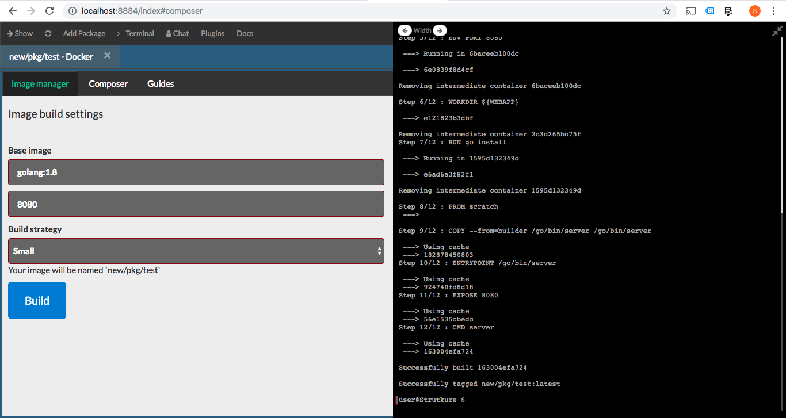
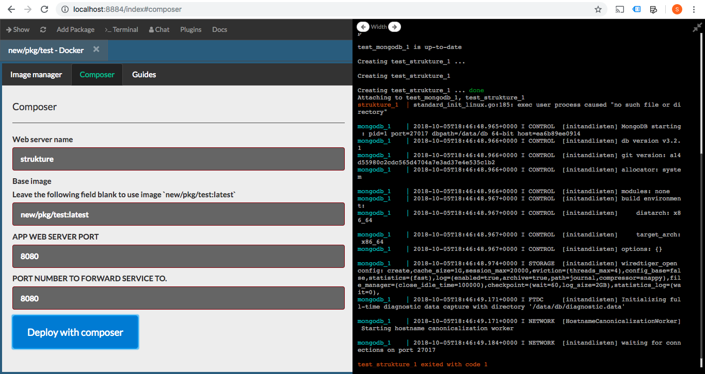
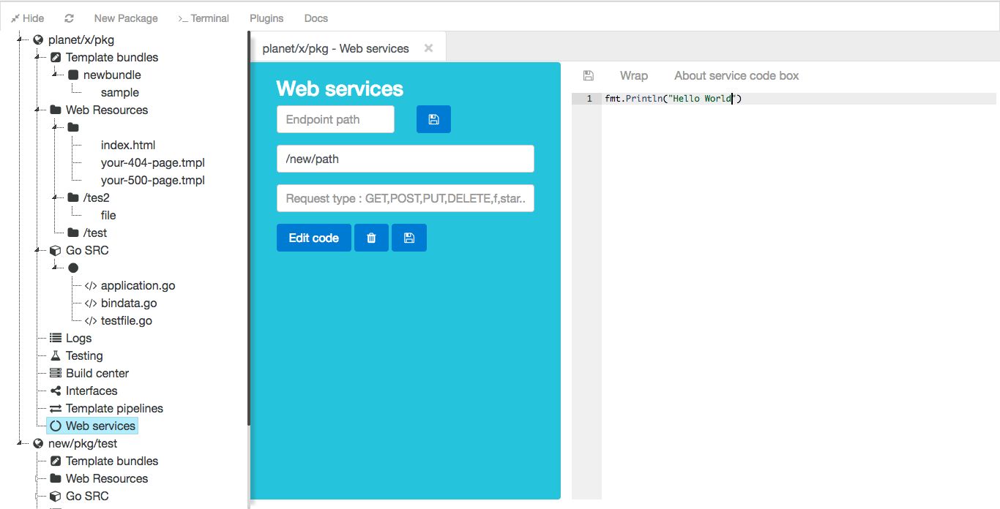
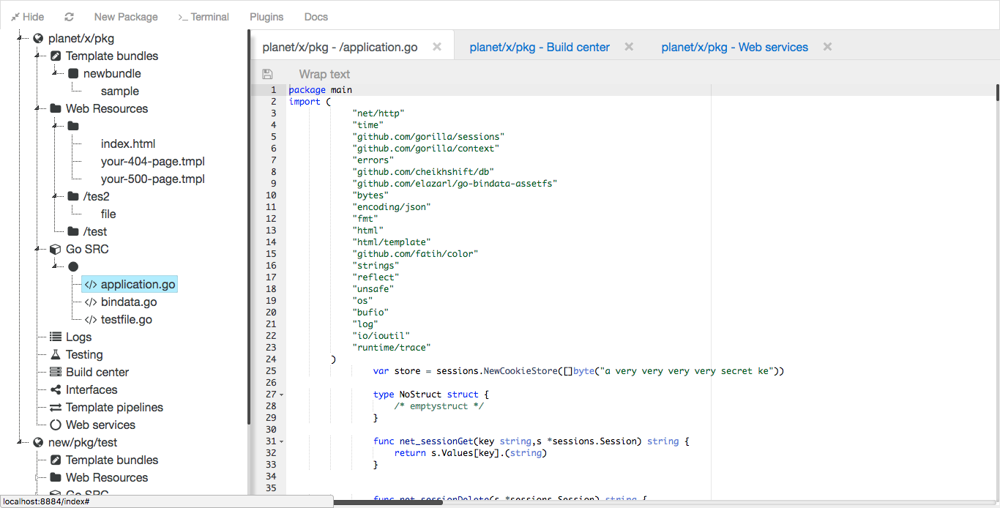
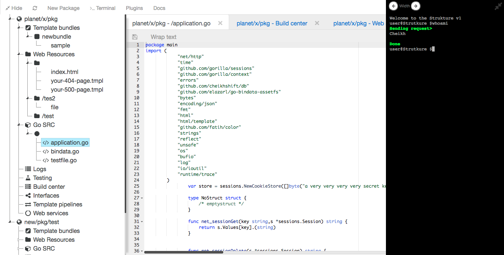
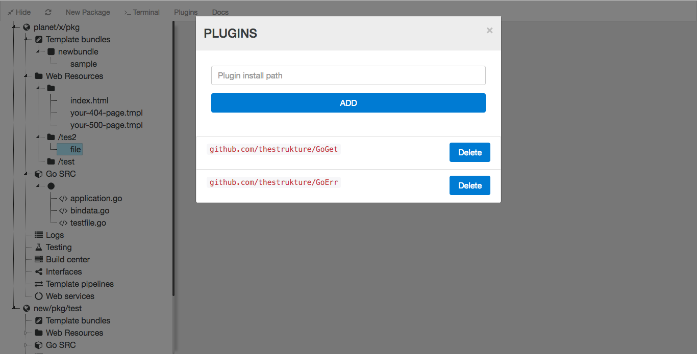
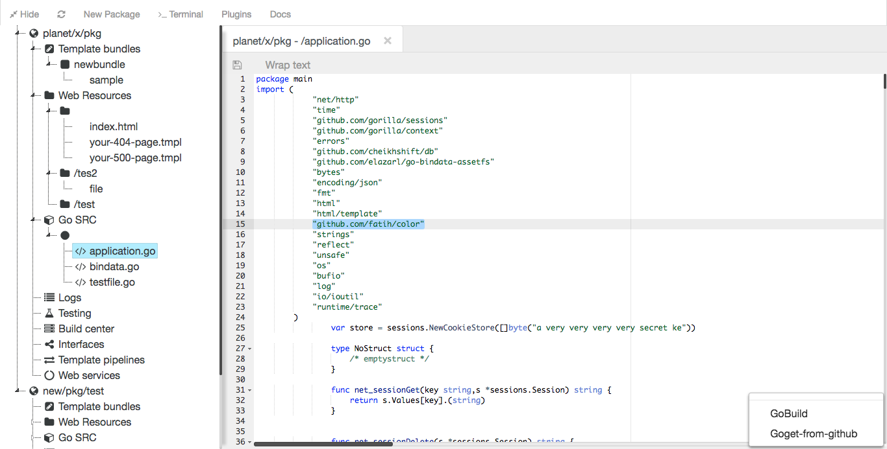

# Strukture IDE

Go lang IDE. Built with [GopherSauce](http://gophersauce.com)

## About IDE
This IDE runs as a server and is accessed via web browser. Being a web server, the IDE boasts a web (HTML) interface is accessible from any device on your network.Compared to Microsoft VS Code and Eclipse CHE, this IDE is very minimalistic. It features :
- Web application resource management.
- Autocomplete between different files. ( This feature is broken as of now.)
- Syntax correction.
- Server process management.
- Interactive terminal via web socket. (Must have bash installed for windows users.)
- Line tags in relation to failed build logs.
- Project build scripts.
- View web application output.
- Build docker images (Must have docker running on host) . 
- Breakpoints and debugging with Delve.

## Requirements
- Go v1.15+.
- Git. Git present as a command on your system.

## First Launch

If the server launch hangs on startup, close it and install the additional requirements manually. Prior to running the commands, set your GOPATH to `$home/workspace`. You can do this on Windows with `set GOPATH=%USERPROFILE%\workspace`.
Run the following command : 

	go get github.com/nsf/gocode

To add debug support, you must install delve. You can find the guide here. (Don't worry it is quick) [Install Delve](https://github.com/go-delve/delve/tree/master/Documentation/installation)

## Install

		$ go get github.com/thestrukture/IDE

#### How to run

		$ IDE

## Access

Visit [localhost:8884/index](http://localhost:8884/index). Access the IDE from any device on your network as well...

## Bug reports & questions :
Please create a new issue on Github to report a bug.

## How to use the strukture

Built-in tutorials coming soon.

### Extending
Automate your work flow with just lines of Javascript. Read the Guide [here](https://github.com/thestrukture/SpringMenu). 

## Contributions
Improvements to the codebase and pull requests are encouraged.

## Screenshots

## License
