# Strukture IDE Beta
Go lang IDE server.

## Requirements
- Unix based OS/CLI.
- Go 1.9 and up.
- $GOPATH set.
- $GOPATH/bin in execution path.
- Install GoS [CLI](http://golangserver.com). ( `$ go get github.com/cheikhshift/gos` )
- Install `GoS` dependencies : `$ gos deps`

## Install

		$ go get github.com/thestrukture/IDE

## Run

		$ IDE

## Access

Visit [localhost:8884/home](http://localhost:8884/home). Access the IDE from any device on your network as well...

## Bug reports & questions :
Please create a new issue on Github to report a bug.

## Community
Access the Strukture forums [here](http://forum.golangserver.com/forumdisplay.php?fid=3)

## Wiki : How to use the strukture

Visit https://github.com/thestrukture/IDE/wiki

## Screenshots

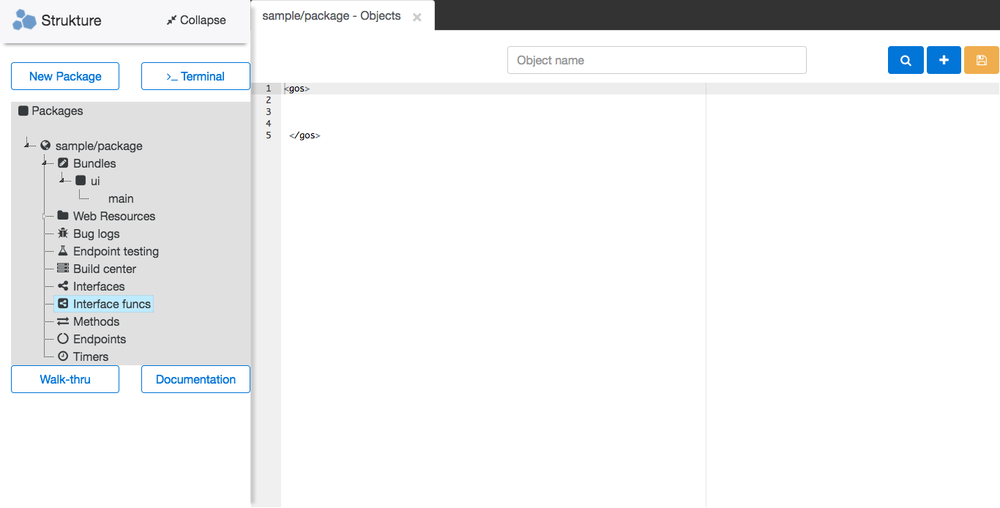
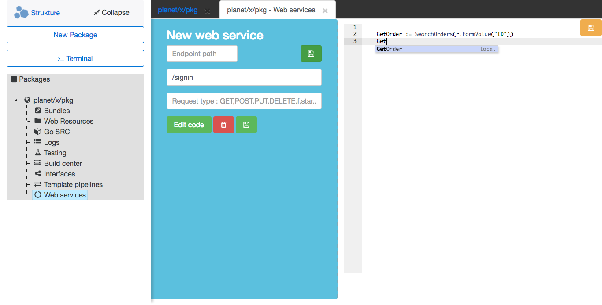
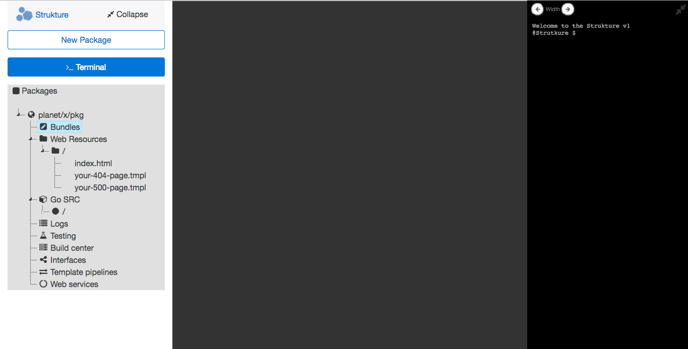
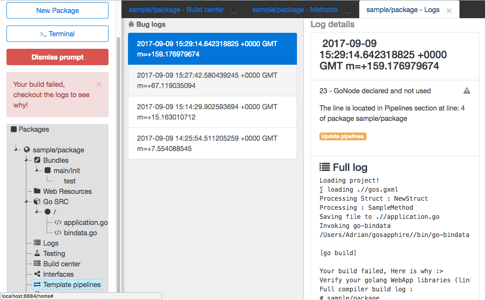
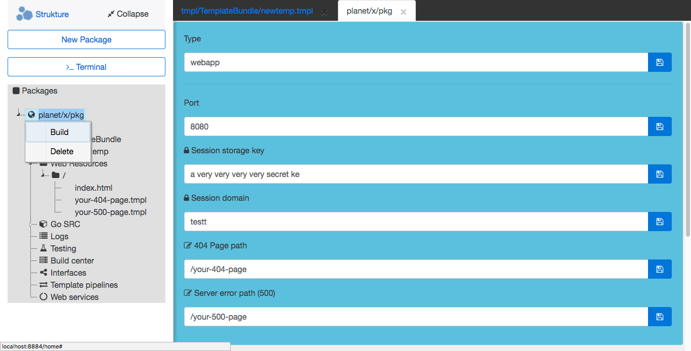
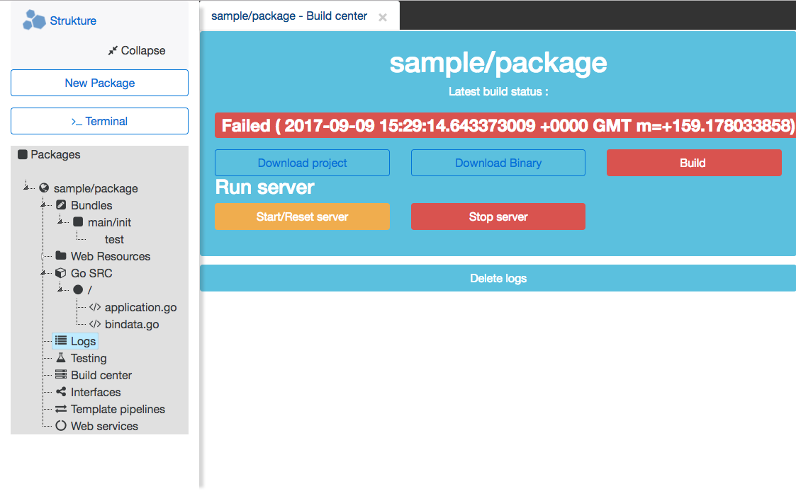
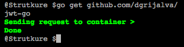
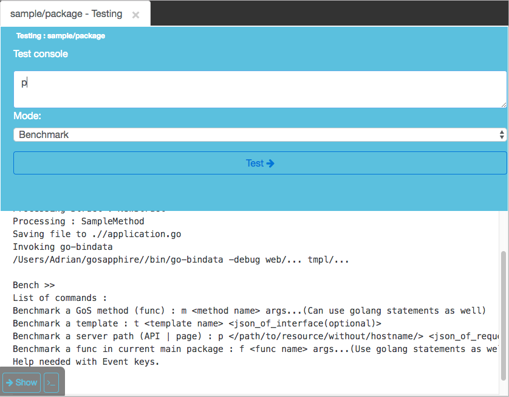
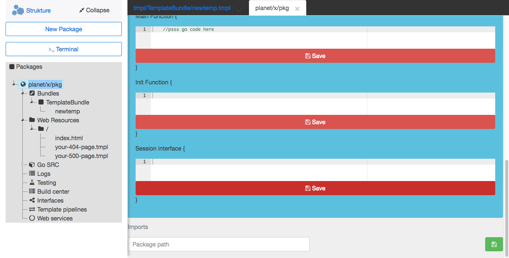
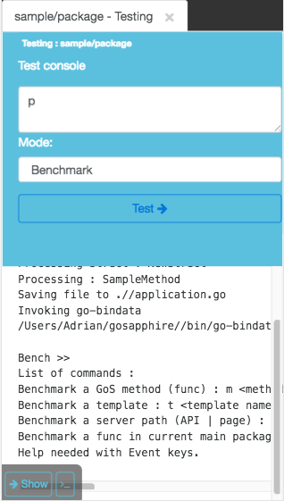
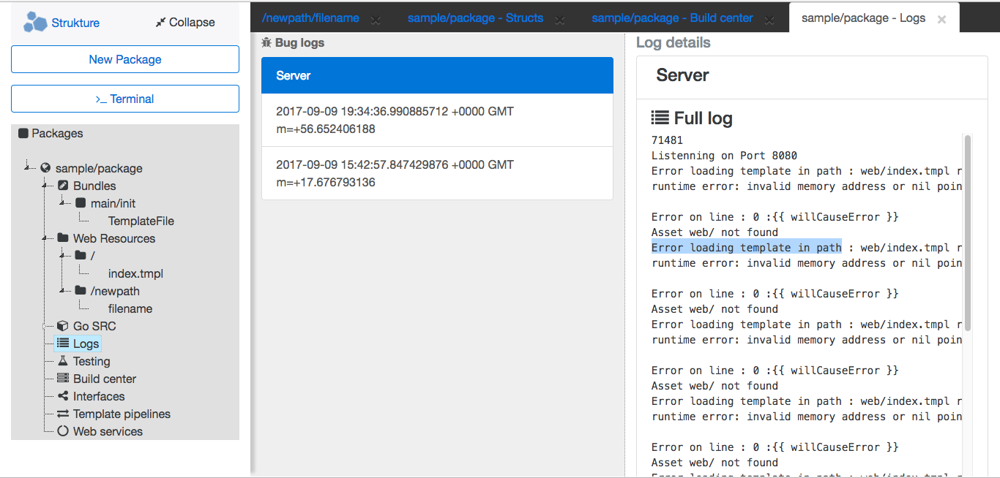

