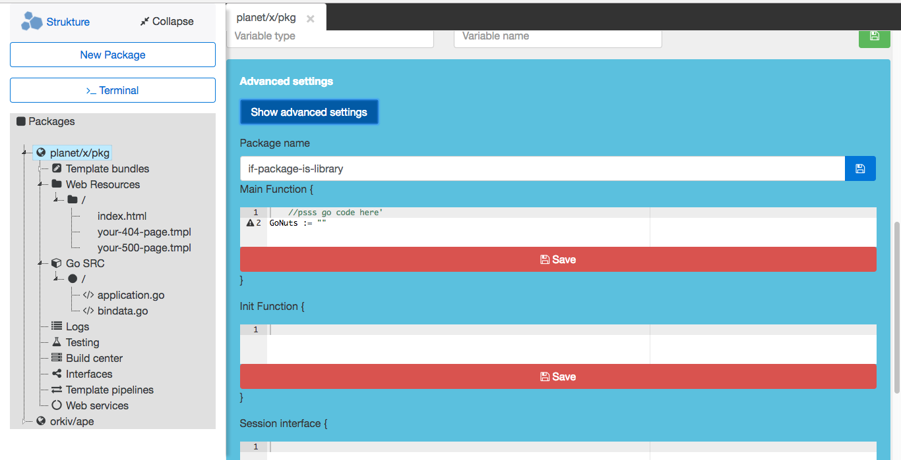

# Strukture IDE Beta
Go lang IDE server.

## About project
The strukture is an open source IDE. It is designed to build web applications, with the organizational help of [Go-Server](http://golangserver.com). The IDE runs as a server and is accessed via web browser. Being a web server, the IDE is accessible from any device on your network. Compared to Microsoft's VS Code and Eclipse CHE this IDE is very minimal. It features :
- Web application resource management.
- Autocomplete between different files.
- Syntax correction.
- Server process management.
- Basic terminal via stateless HTTP.
- Line tags in relation to failed build logs.
- Project build scripts.

## Requirements
- Unix based OS/CLI.
- Go 1.9 and up. [Find it here](https://golang.org/dl/).

## Misc info
How to install GoS incase the built-in installer fails.

- Install GoS [CLI](http://golangserver.com). ( `$ go get github.com/cheikhshift/gos` )
- Install `GoS` dependencies : `$ gos deps`

## Install

		$ go get github.com/thestrukture/IDE

## Run

		$ IDE

## Access

Visit [localhost:8884/home](http://localhost:8884/home). Access the IDE from any device on your network as well...

## Bug reports & questions :
Please create a new issue on Github to report a bug.

## Community
Access the Strukture forums [here](http://forum.golangserver.com/forumdisplay.php?fid=3)

## Wiki : How to use the strukture

Visit https://github.com/thestrukture/IDE/wiki

## Screenshots

